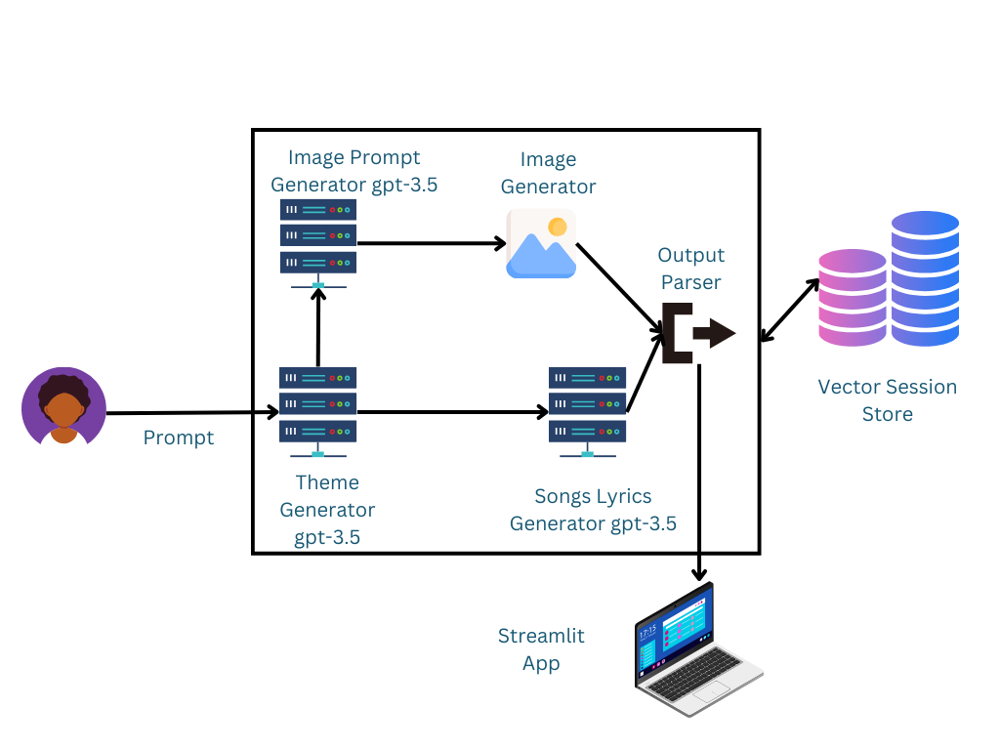
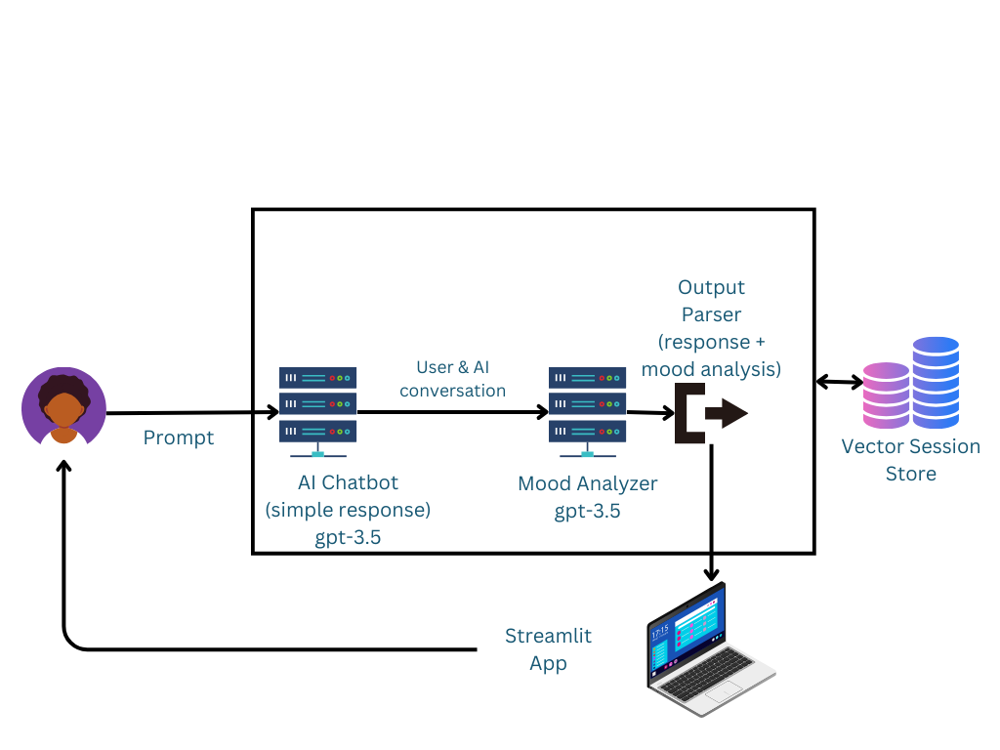
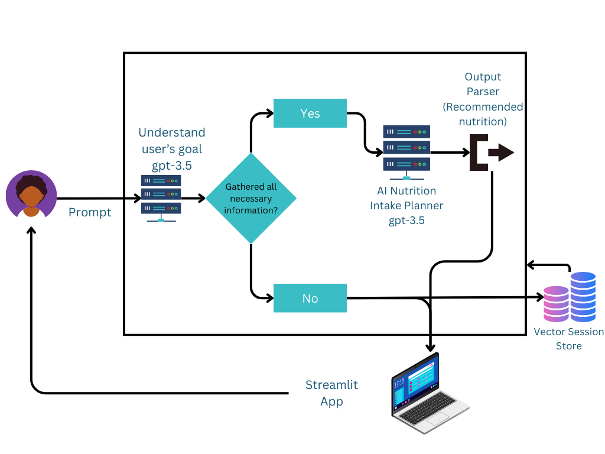

# NLP Playground (OpenAI)

This repository contains three AI projects developed as part of a university assignment using the LangChain framework in combination with Streamlit and OpenAI API. The projects showcase the application of natural language processing (NLP) techniques to automate complex language-rich tasks.

### Requirements (for local development)

- [Python](https://www.python.org/) (>=3.6)
- [Streamlit](https://streamlit.io/)
- [OpenAI API Key](https://beta.openai.com/signup/)

### Links to the running applications
- [AI Album Generator](https://nlpplayground-cbvh5qm8ksymqcq4ecnjlt.streamlit.app/)
- [Mood Analyzer](https://nlpplayground-sayfmuzagr9h8yikbebgco.streamlit.app/)
- [Health and Fitness Advisor](https://nlpplayground-igljhf9cldf6nt3rbtpoja.streamlit.app/)

## AI Album Generator
album_generation_app.py

The AI Album Generator is an application that uses OpenAI's GPT-3.5 Turbo model to generate custom album themes, cover images, and song lyrics based on only user prompts. The application utilizes a conversational approach, allowing users to interact with the model using single prompt.

### Features

- **Album Theme Generation:** Users provide prompts, and the model generates an album theme that influences the cover image and song lyrics.
- **Album Cover Image Generation:** The generated theme is used to create an album cover image using GPT-3.5 Turbo.
- **Song Lyrics Generation:** The model generates a specified number of songs based on the album theme.

## 2. Mood Analyzer
mood_analyzer.py

The Mood Analyzer is an application that uses OpenAI's GPT-3.5 Turbo model to generate responses based on user input and analyze the mood of the conversation.

### Features
- **Response Generation**: Users provide text, and the model generates responses.
- **Mood Analysis**: The model analyzes the mood of the conversation and outputs a mood emoji.

## 3. Health and Fitness Advisor
streamlit_app.py

The Health and Fitness Advisor is an application that utilizes OpenAI's GPT-3.5 Turbo model to provide health and fitness advice based on user input. It saves the history of the conversation and uses it to generate more personalized responses.

### Features
- **Health Advice Generation**: Users provide their weight, height, age, and goals, and the model generates health advice.
- **Nutritional Advice (removed in prod)**: The model provides nutritional advice based on the user's goals.
- **Recipe Recommendations (removed in prod)**: Users receive short and concrete lists of foods based on nutritional advice.
- **Concluding Advice (removed in prod)**: The model combines responses and provides concise health and fitness advice.

## Author

Alex Svetoslavov
alex@rizzii.net
